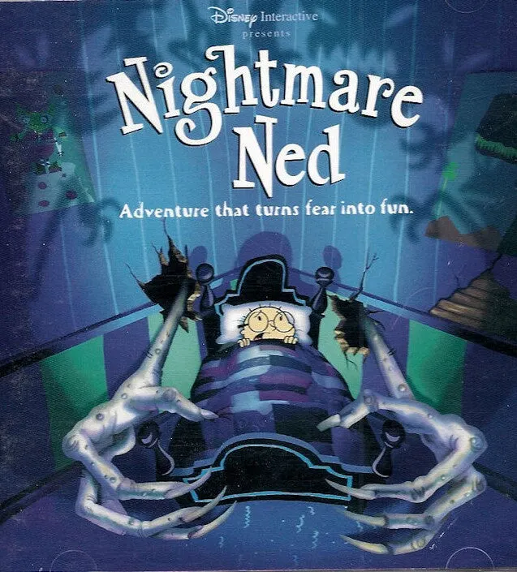

# Nightmare Ned on Batocera (via 86Box + Windows 98 SE)

Getting Disney Interactive's 1997 point-and-click adventure **Nightmare Ned** running
as a first-class entry in **Batocera Linux**, launched from the game menu straight into
fullscreen gameplay.

The game will not run natively on a modern OS: it relies on Intel RDX/DINO 3D middleware
and Smacker FMV (`SMACKW32.DLL`) targeting Windows 95/98-era DirectX. The reliable path is
full-machine emulation of a period PC. This setup emulates a Pentium-133 running Windows 98 SE
inside **86Box**, with the game installed to the emulated hard disk and set to auto-launch.

### Why emulation and not Wine?

Batocera's built-in **"Windows" system runs games through Wine** (a compatibility layer that
runs a Windows `.exe` directly on Linux — that's how e.g. Phantasy Star Online BB works). Wine
is *not* a viable path for Nightmare Ned:

- There is **no WineHQ AppDB entry** for the game (a forum claim of a "Platinum rating" could
  not be substantiated — nothing exists in the database).
- Every documented "it runs" report is actually **emulation**, not native Wine: the widely used
  Collection Chamber release literally bundles **PCem running Windows 98**, and the "Steam Deck
  success" people describe is *PCem run under Proton*, i.e. the emulator inside Wine — not the
  game itself under Wine. (86Box, used here, is a fork of PCem.)
- The game's known blockers are exactly what an emulator solves and Wine does not: a **16-bit
  installer stub**, a hard **CPU-speed dependency** (runs uncontrollably fast without cycle
  throttling), timing-sensitive audio, and the obscure Intel 3D RDX/DINO renderer.

Conclusion: full-machine emulation (86Box + real Win98) is the correct and canonical approach.

**Status:** working. Boots straight into the game in fullscreen, auto-launched, no password
prompt; verified persistent across an EmulationStation restart. Rebuilt as a **lean VM** — a
**700 MB** disk (down from the original 2 GB; ~332 MB actually used) with a minimal *Compact*
Win98 SE install.

> **Reproducing this from scratch?** See **[SETUP.md](SETUP.md)** for the full step-by-step
> (bring your own Win98 ISO + game files), and **[vm/](vm/)** for the ready-made 86Box config,
> the Batocera launcher wrapper, and the disk-creation script.



---

## Target environment

| | |
|---|---|
| Host | Dell laptop running **Batocera v43** (2026-04-29 build) |
| Emulator | **86Box v6.0**, installed as a Flatpak (`net._86box._86Box` + `.ROMs`) |
| Guest OS | **Windows 98 SE** (OEM) |
| Game | **Nightmare Ned** (Disney Interactive / Creative Capers Entertainment, 1997) |

### Emulated machine (86Box VM "Nightmare Ned")

| Component | Value | 86Box id |
|---|---|---|
| Machine | ASUS P/I-P55T2P4 (Intel 430HX) | `p55t2p4` |
| CPU | Intel Pentium 133 MHz (P54C), internal FPU | `pentium_p54c`, `cpu_speed = 133333333` |
| RAM | 64 MB | `mem_size = 65536` |
| Video | Cirrus Logic GD5446 (PCI) | `cl_gd5446` |
| Sound | Sound Blaster 16 | |
| Mouse | PS/2 | `mouse_type = ps2` |
| Hard disk | **700 MB** raw, FAT32, `ramdisk` speed | geometry `63, 16, 1422` |
| CD-ROM | ATAPI, IDE channel 0:1 | game `.cue` mounted permanently |
| Display | 640×480, 256 colors | `dpi_scale=0`, `video_fullscreen_scale=1` |

Rationale: this is a stable, well-supported 86Box machine profile for the Win98 era. The
Cirrus GD5446 has a reliable Win98 driver, and the P133/64 MB combo comfortably exceeds the
game's requirements while staying period-accurate enough to avoid timing bugs.

---

## Files & paths on the Batocera box

Everything lives under `/userdata`.

```
/userdata/nightmarened/
  Nightmare.Ned.cue              # CD cue sheet (edited — see gotchas)
  Nightmare.Ned.BIN              # CD binary image (~650 MB)
  iso/win98se.iso                # Windows 98 SE install media (install-time only)

/userdata/saves/flatpak/data/.var/app/net._86box._86Box/data/86Box/Virtual Machines/Nightmare Ned/
  86box.cfg                      # VM hardware config (see machine table above)
  <disk image>                   # emulated HDD with Win98 + game installed

# Batocera menu entry
/userdata/roms/flatpak/86Box developers.flatpak       # romId file → "net._86box._86Box"
/userdata/roms/flatpak/gamelist.xml                   # entry metadata (name/art/video/desc)
/userdata/roms/flatpak/images/nightmare_ned_box.webp  # box art   → <image>/<thumbnail>
/userdata/roms/flatpak/images/nightmare_ned_logo.webp # title logo → <marquee>
/userdata/roms/flatpak/images/ned_background.jpg      # fanart    → <fanart>
/userdata/roms/flatpak/videos/nightmare_ned.mp4       # trailer   → <video>

# Flatpak launch wrapper (patched — see below)
/userdata/saves/flatpak/binaries/app/net._86box._86Box/x86_64/stable/active/files/bin/
  86Box.sh                       # patched wrapper
  86Box.sh.orig                  # original, kept as backup
```

---

## How the menu launch works

When you select the entry in Batocera, EmulationStation runs Batocera's flatpak generator,
which executes literally:

```sh
SDL_JOYSTICK_HIDAPI_XBOX=0 /usr/bin/flatpak run -v net._86box._86Box
```

That runs the Flatpak's `86Box.sh` entrypoint **with no arguments**. The wrapper is patched so
that the no-argument case boots the Nightmare Ned VM directly in fullscreen:

```sh
#!/bin/sh
mkdir -p ${XDG_DATA_HOME}/86Box/roms
mkdir -p ${XDG_CONFIG_HOME}/86Box
# When launched with no arguments (e.g. from the Batocera menu), boot straight
# into the Nightmare Ned VM in fullscreen. Manual launches with args still work.
if [ $# -eq 0 ]; then
  exec 86Box --vmpath "${XDG_DATA_HOME}/86Box/Virtual Machines/Nightmare Ned" --vmname "Nightmare Ned" --fullscreen
fi
exec 86Box "$@"
```

Windows 98 then boots, and a shortcut in the **StartUp** folder auto-launches the game — so
selecting the menu entry lands you in gameplay with no further clicks.

### Exiting the game / returning to Batocera

Both methods quit **all** of 86Box and return to the Batocera menu (no `confirm_exit` prompt —
`confirm_exit = 0` is set in `86box_global.cfg`):

- **Controller (DualSense):** **PS button + Options** — Batocera's standard exit-game hotkey
  (`hotkey + start`), which runs `flatpak kill $(flatpak ps --columns=application | head -n 1)`.
- **Mouse / keyboard:** **middle-click** (or `Ctrl + End`) to release 86Box's mouse grab, then
  **`Alt + F4`** to quit the emulator. Simple and instant.

When 86Box closes, EmulationStation returns to the foreground at the game menu.

> `Ctrl + Alt + Del` is sent *into* Windows 98 — it does **not** quit the host.

**Cleanest (recommended occasionally)** to keep the Win98 disk image healthy: quit the game
(`Esc`/`Alt+F4`), then **Start → Shut Down → "Shut down"**, wait for *"It's now safe to turn
off your computer"*, and only then close 86Box. A hard exit is fine for casual play — this is a
CD game that barely writes to disk, and Win98 runs ScanDisk on the next boot if needed.

---

## Batocera menu entry (`gamelist.xml`)

The generic auto-generated flatpak entry ("86Box developers") is overridden with proper
Nightmare Ned metadata, box art, a title logo, and a preview video:

```xml
<?xml version="1.0"?>
<gameList>
	<game>
		<path>./86Box developers.flatpak</path>
		<name>Nightmare Ned</name>
		<desc>Ten-year-old Ned Needlemeyer is pulled into a nightmare universe stitched together from a magical quilt ... An adventure that turns fear into fun.</desc>
		<image>./images/nightmare_ned_box.webp</image>
		<thumbnail>./images/nightmare_ned_box.webp</thumbnail>
		<marquee>./images/nightmare_ned_logo.webp</marquee>
		<fanart>./images/ned_background.jpg</fanart>
		<video>./videos/nightmare_ned.mp4</video>
		<rating>1.0</rating>
		<releasedate>19971007T000000</releasedate>
		<developer>Creative Capers Entertainment / Window Painters Ltd.</developer>
		<publisher>Disney Interactive</publisher>
		<genre>Adventure</genre>
		<players>1</players>
		<lang>en</lang>
		<region>us</region>
		<family>Nightmare Ned</family>
		<kidgame>true</kidgame>
	</game>
</gameList>
```

Media/metadata mapping (verified rendering in the Batocera v43 default theme):

| Tag | Value | Where it shows |
|---|---|---|
| `<image>` / `<thumbnail>` | box cover (`nightmare_ned_box.webp`) | the entry tile |
| `<marquee>` | title logo (`nightmare_ned_logo.webp`) | logo, top-left |
| `<fanart>` | dream-world screenshot (`ned_background.jpg`) | full-screen background |
| `<video>` | trailer (`nightmare_ned.mp4`, h264/AAC) | preview panel, plays on select |
| `<rating>` | `1.0` (float 0.0–1.0) | **five** stars |
| `<lang>` / `<region>` | `en` / `us` | language + region flags |
| `<kidgame>` | `true` | kid-game badge; shows in Kid mode |
| `<family>` | `Nightmare Ned` | collection grouping |

> The description is sourced from the game's [Wikipedia article](https://en.wikipedia.org/wiki/Nightmare_Ned)
> (full text is in the deployed `gamelist.xml`; abbreviated above).

> `.webp` images render fine in Batocera v43's EmulationStation (verified on screen). PNG
> copies are kept alongside as a fallback in case a different theme/build can't decode webp.

> **Keep `<path>` as `./86Box developers.flatpak`.** That filename is the romId file whose
> contents (`net._86box._86Box`) drive the launch. Rename the *display name*, never the file.

### Making edits persist across restarts

EmulationStation caches the gamelist in memory and **rewrites `gamelist.xml` on graceful exit**
from that memory. Editing the file while ES runs is therefore fragile:

- **Image/video paths hot-reload** — ES re-reads `<image>`, `<marquee>`, `<fanart>`, `<video>`
  from disk without a restart, so art/video changes appear live.
- **Text fields are cached** — `<name>`, `<desc>`, `<rating>`, etc. are held in memory and only
  refresh on a full ES reload.

To make a text edit stick, ES must be **hard-killed** (so it dies without saving its stale
memory over your file) and then respawned so it re-reads disk:

1. Edit `gamelist.xml` on disk.
2. Hard-kill the ES binary + its dbus parent (the launcher respawns ES automatically):
   ```sh
   pkill -9 -f "exit-on-reboot-required"
   ```

**Two traps, both learned the hard way:**

- **Match `exit-on-reboot-required`, not `emulationstation --exit-on-reboot-required`.** After
  its first respawn, ES's command line becomes
  `emulationstation --no-startup-game --exit-on-reboot-required --windowed`, so the tighter
  pattern silently matches nothing and the "restart" becomes a no-op. The `exit-on-reboot-required`
  substring matches the ES binary and its `dbus-run-session` parent, but **not** the
  `emulationstation-standalone` wrapper or `openbox` — those must survive to respawn ES.
- **Use `kill -9`, never a graceful `batocera-es-swissknife --restart`, when disk is ahead of
  memory.** A graceful exit writes ES's stale in-memory copy back over your good file, reverting
  the edit on disk too. Hard-kill = no save = respawn reads disk. (Once ES has reloaded your edit,
  its memory matches disk and normal graceful restarts preserve it.)

Note: `batocera-flatpak-update` does **not** run at boot, so it will not regenerate/overwrite
the entry.

---

## Presenting it as a "Windows 98" system

The game is launched via the flatpak generator, so by default it appears under Batocera's
generic **"Flatpak"** system. To give it a proper home, it's surfaced as its own **"Windows 98"**
system in the carousel using a **custom collection** (this keeps the working flatpak launch
untouched — a collection is only a view). It sits alongside the built-in Wine-based "Windows"
system.

**Collection file** — `/userdata/system/configs/emulationstation/collections/custom-Windows 98.cfg`,
one absolute game path per line:

```
/userdata/roms/flatpak/86Box developers.flatpak
```

**Settings** — in `/userdata/system/configs/emulationstation/es_settings.cfg`:

```xml
<string name="CollectionSystemsCustom" value="Windows 98" />   <!-- enable the collection -->
<bool   name="UseCustomCollectionsSystem" value="false" />     <!-- show it as its OWN carousel entry, not grouped under "Custom Collection" -->
<string name="HiddenSystems" value="...;flatpak" />            <!-- hide the generic Flatpak system so the game shows in ONE place -->
```

`es_settings.cfg` is rewritten by ES on exit just like `gamelist.xml`, so apply edits and then
hard-reload with `pkill -9 -f "exit-on-reboot-required"` (see the persistence notes above).
Hiding the `flatpak` system is safe here because Nightmare Ned is its only entry; the game still
launches normally from the collection.

### Theming the "Windows 98" system (ckau-book)

Theming is keyed off `${system.theme}`, which for a custom collection equals the collection name
(`Windows 98`). Theme files live under `/userdata/themes/ckau-book/` and are **not** rewritten by
ES (only a theme re-download would revert them), but ES caches the theme in memory — so after
editing, hard-reload ES the same way.

- **Carousel logo** — `_inc/logos/collections/Windows 98.png`. The theme probes
  `logos/collections/${system.theme}.png|svg`. Source was `500px-Microsoft_Windows_98_logo_with_wordmark.svg.webp`,
  converted to PNG (the theme references png/svg, not webp). Also register the name in
  `/userdata/themes/ckau-book/collections.info` (one name per line) so the theme treats it as a
  themed collection.
- **Background color** — add to `_inc/elements/syscolors.xml`, right after the `windows` entry:
  ```xml
  <sysColor if="${system.theme} == 'Windows 98'">008080</sysColor>
  ```
  `008080` is the classic Windows-98 desktop teal.

### System metadata — date, manufacturer, description (from Wikipedia)

ckau-book **does** show a system's year, manufacturer, and description in its system view — but
it does **not** read them from metadata variables. Each system's text is hardcoded in a per-system
layout file, `_inc/layouts/<system.theme>.xml`, pulled in by `theme.xml`'s
`<include>./_inc/layouts/${system.theme}.xml</include>`. Real systems ship one (e.g.
`windows.xml`); custom collections don't, which is why ours initially showed only the logo and
video.

The fix: create `_inc/layouts/Windows 98.xml` (the filename must equal `${system.theme}`, i.e. the
collection name, spaces and all). It defines the `system` view's named text elements. A copy is in
this repo at [`assets/ckau-book-layout-Windows 98.xml`](assets/ckau-book-layout-Windows%2098.xml):

```xml
<view name="system">
  <image name="sysbg-video"> ... </image>   <!-- position/size copied from windows.xml -->
  <video name="videobox">    ... </video>
  <text name="TextDate">        <text>1998</text></text>
  <text name="TextManufacturer"><text>Microsoft</text></text>
  <text name="TextName">        <text>Windows 98</text></text>
  <text name="TextDesc">        <text>Windows 98 is a consumer-oriented ...</text></text>
</view>
```

This works for a **collection** exactly as for a real system: both use the same `system` view, and
the include resolves on `${system.theme}`. Values below are sourced from
<https://en.wikipedia.org/wiki/Windows_98>:

| Field | Value |
|---|---|
| Manufacturer / developer | Microsoft |
| Original release | 25 June 1998 |
| Second Edition (SE) release | 10 June 1999 |
| OS family | Windows 9x (consumer) |
| Architecture | Hybrid 16/32-bit, MS-DOS boot stage, IA-32; monolithic kernel |
| Predecessor | Windows 95 (1995) |
| Successor | Windows Me (2000) |
| Description | Windows 98 is a consumer-oriented operating system in Microsoft's Windows 9x line. It added USB and DVD support, the Windows Driver Model, and a web-integrated shell that shaped later Windows releases. |

### Hardware photo as the system art, with the trailer playing on the CRT

The `system` view's `sysbg-video` (image) and `videobox` (video) elements are repurposed so the
system art is a photo of a period Dell tower + CRT + keyboard, with the game trailer playing on
the monitor screen. Final layout: [`assets/ckau-book-layout-Windows 98.xml`](assets/ckau-book-layout-Windows%2098.xml).

```xml
<image name="sysbg-video">
  <path>/userdata/themes/ckau-book/_inc/pc/windows98-pc.png</path>
  <color>ffffffff</color>            <!-- REQUIRED: sysbg-video is black-tinted by default; force true color -->
  <origin>0.5 0.5</origin><pos>0.5 0.46</pos><size>0.42 0.56</size>
</image>
<video name="videobox">              <!-- the trailer, sized/placed onto the CRT glass -->
  <origin>0.5 0.5</origin><pos>0.552 0.382</pos><size>0.195 0.28</size>
</video>
```

Two gotchas found while positioning:

- **`sysbg-video` is tinted black by default** — without `<color>ffffffff</color>` the photo renders
  as a black silhouette.
- **These elements are laid out in a left-panel container, not full-screen** — `pos` ~0.5 means
  *centered in the left panel* (≈0.24 of the screen), not screen-center. The video's position was
  derived from that container→screen mapping so it lands on the monitor glass.

**Making the transparent PNG (no dependencies, macOS-native):** background removal was done with a
tiny Swift program using the Vision framework's `VNGenerateForegroundInstanceMaskRequest`
(`generateMaskedImage(ofInstances:from:croppedToInstancesExtent:)`), which isolates the foreground
subject and writes an RGBA PNG. Source: [`assets/bgremove.swift`](assets/bgremove.swift). Build/run:

```sh
swiftc -O bgremove.swift -o bgremove
./bgremove input.jpg output.png    # transparent-background PNG
```

This needs macOS 14+ (tested on macOS 26.5, Swift 6.3) — no `rembg`/ImageMagick/downloads.

---

## Installation notes & gotchas

Things that bit us, and the fixes:

- **`.cue` file case-sensitivity.** The `.cue` referenced `Nightmare.Ned.bin` but the file on
  a case-sensitive Linux filesystem is `Nightmare.Ned.BIN`. Fix: edit the cue to match exactly:
  ```
  FILE "Nightmare.Ned.BIN" BINARY
    TRACK 01 MODE1/2352
      INDEX 01 00:00:00
  ```

- **Win98 CD won't boot → black screen.** Not a hang — the Windows 98 setup CD's boot menu
  auto-selects *"Boot from Hard Disk"*. Select the **CD-ROM** option (menu item 2) to start setup.

- **Product key.** Win98 FE and retail keys are rejected by the SE OEM installer. A known-working
  Win98 SE OEM key: `R3TQR-PQTKG-HBVQ9-YBFH3-CGCRT`.

- **"Insert Disk" prompt for `mouse.drv`.** During setup Windows may ask for the CD to copy a
  file. If the install CD isn't mounted at that moment, point the *"Copy files from"* path at
  `C:\WINDOWS\SYSTEM`.

- **Recurring "Add New Hardware / monitor" wizard.** Install a monitor driver (Standard /
  Plug-and-Play Monitor) so Windows stops re-running the wizard every boot.

- **Add the PS/2 mouse** in 86Box Settings before installing Windows, or the guest has no
  usable pointer.

- **Auto-launch the game.** Copy the game's Start Menu shortcut into the StartUp folder:
  ```
  copy "C:\WINDOWS\Start Menu\Programs\Disney Interactive\Nightmare Ned.lnk" "C:\WINDOWS\Start Menu\Programs\StartUp"
  ```

---

## Reproducing from scratch (outline)

1. Install the **86Box** Flatpak on Batocera (`net._86box._86Box` + its `.ROMs` companion).
2. Create a VM named **Nightmare Ned** with the hardware in the machine table above; add the
   PS/2 mouse.
3. Attach the Win98 SE ISO as the CD, boot from CD-ROM, install Win98 SE (OEM key above).
4. Install the Cirrus GD5446 video driver and a monitor driver.
5. Swap the CD image to `Nightmare.Ned.cue` and install the game.
6. Copy the game shortcut into the Windows **StartUp** folder.
7. Patch `86Box.sh` (no-arg → fullscreen VM boot); keep `86Box.sh.orig` as backup.
8. Override the flatpak `gamelist.xml` entry with Nightmare Ned name/art/description, and make
   it persist per the steps above.

---

## Credits / references

- Game: *Nightmare Ned* © 1997 Disney Interactive, developed by Creative Capers Entertainment.
- Emulator: [86Box](https://86box.net/).
- Frontend: [Batocera Linux](https://batocera.org/).
